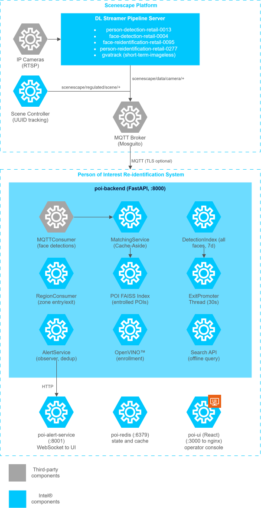

# Person of Interest Re-identification

<!--hide_directive
<div class="component_card_widget">
  <a class="icon_github" href="https://github.com/intel-retail/storewide-loss-prevention/tree/release-2026.2.0/person-of-interest">
     GitHub project
  </a>
  <a class="icon_document" href="https://github.com/intel-retail/storewide-loss-prevention/blob/release-2026.2.0/person-of-interest/README.md">
     Readme
  </a>
</div>
hide_directive-->

The Person of Interest (POI) Re-identification system is a real-time retail loss-prevention
application that detects enrolled Persons of Interest (POIs) across multiple cameras and
generates instant security alerts. It also supports offline historical investigation to trace
where a queried person appeared across all cameras and time ranges.

## Overview

The **POI Re-identification** system leverages OpenVINO™ face detection and
re-identification models integrated with Scenescape spatial computing to deliver
real-time biometric person matching in multi-camera retail environments. By processing
256-dimensional face embeddings at the edge using Facebook AI Similarity Search (FAISS) vector
search, the system enables sub-second POI detection with minimal latency while maintaining
data privacy — all biometric processing stays local.

### Example Use Cases

- **Real-Time Suspect Detection:** Instantly alerts security personnel when an enrolled
  shoplifter or banned individual appears on any camera in the store.
- **Historical Investigation:** Enables loss-prevention analysts to upload a suspect's image
  and trace their movement across all cameras and time ranges, including region dwell times.
- **Multi-Camera Tracking:** Correlates person detections across multiple camera views using
  face re-identification embeddings for unified tracking.
- **Region-Based Analytics:** Tracks entry, exit, and dwell time per store zone (aisles,
  checkout, entrance) for behavioral analysis.

### Key Benefits

- **Edge-Optimized Inference:** All face detection and re-identification runs locally using
  OpenVINO™, ensuring data privacy and low latency.
- **Real-Time Alerting:** Sub-second alert pipeline from camera detection to security
  notification via WebSocket, MQTT, and webhook strategies.
- **Scalable Architecture:** Clean Architecture with microservices enables independent
  scaling of backend, UI, and alert service.
- **Flexible Deployment:** Docker Compose deployment with support for both local and
  registry-based image management.
- **Scenescape Integration:** Leverages Scenescape for spatial scene understanding,
  region tracking, and multi-camera calibration.

## How it Works

This section provides a high-level architecture view of the POI Re-identification system
and how it integrates with Scenescape and DL Streamer pipelines.

### System Architecture



### Data Flow: Online (Real-Time POI Detection)

```text
Camera → DL Streamer → MQTT → MQTTConsumer → FAISS POI Search → AlertService → UI
                                  │
                                  ├─ Store detection embedding + full-body frame in DetectionIndex
                                  └─ ExitPromoterThread promotes exit embeddings to FAISS (30s cycle)
```

1. DL Streamer processes camera frames, generating face embeddings (256-d) and person bounding
   boxes, published via MQTT.
2. The **MQTTConsumer** extracts face embeddings and stores each detection in the Detection
   FAISS index with metadata and a full-body person frame (not just face crop).
3. The **MatchingService** checks the Cache-Aside cache, then performs FAISS cosine search
   against enrolled POI embeddings (threshold ≥ 0.70).
4. On match, an alert is dispatched via the **Alert Service** to the UI over WebSocket.
5. The **ExitPromoterThread** (background, every 30s) promotes the last face embedding for
   ended tracks into FAISS as durable exit records, ensuring exit data survives Redis TTL
   expiry.
6. The **RegionConsumer** receives Scenescape regulated scene events and stores region
   entry/exit records with dwell times, indexed for fast batch lookups.

### Data Flow: Offline (Historical Search)

```text
User uploads image → OpenVINO™ → Detection FAISS (search_k=2000) → Filter + Batch Metadata
    → Group by track → Attach entry/exit frames + zone dwells → Return timeline
```

1. User uploads a face image via the **Search API**.
2. OpenVINO™ generates a 256-d query embedding (same model as DL Streamer).
3. The Detection FAISS index (all faces seen in the last 7 days) is searched with a wide
   `search_k` to ensure cross-camera recall (the same person may score very differently
   across cameras due to viewing angle).
4. Metadata for matching vectors is fetched in a single pipelined Redis MGET call.
5. Results are filtered by time range and similarity threshold, then grouped by
   track/appearance with entry frames, exit frames (from rolling exits, promoted FAISS
   exits, or durable final-exit records), and zone dwell history.
6. A timeline of appearances is returned, sorted by similarity, with both cameras
   represented.

### Key Components

- **POI Backend (FastAPI)**:
  The core application server handling POI enrollment, FAISS vector search, MQTT event
  consumption, alert generation, and REST API endpoints. Includes the ExitPromoterThread
  for durable exit data and batch-optimized offline search. Runs on port `8000`.

- **React UI**:
  A React + TypeScript single-page application served via nginx, providing the operator
  interface for POI enrollment, real-time alert monitoring with WebSocket push, camera
  views, and historical search with entry/exit frames and zone dwell timelines.
  Runs on port `3000`.

- **Redis**:
  In-memory data store for POI metadata, detection metadata and frames (7-day TTL),
  movement events, alert records, object-to-POI cache (Cache-Aside pattern), region
  dwell records with secondary SET index for fast batch lookups, and track gate lifecycle
  management.

- **FAISS Vector Index**:
  Two FAISS `IndexFlatIP` indices on L2-normalized 256-dimensional vectors for cosine
  similarity: one for enrolled POI embeddings (real-time matching), and one for all
  detected faces over a 7-day window (offline historical search). Exit embeddings are
  promoted into the detection index by the ExitPromoterThread for durable exit data.

- **Alert Service**:
  Dedicated microservice for alert fan-out — dispatches POI match alerts via logging,
  WebSocket (to UI), and MQTT channels. Runs on port `8001`.

- **Scenescape + DL Streamer**:
  Upstream inference pipeline providing person detection, face detection, and face
  re-identification via MQTT. DL Streamer runs the OpenVINO™ models; Scenescape provides
  spatial scene management, region tracking, and multi-camera UUID coordination.

### Key Features

- **Feature 1**: Real-time POI face matching using FAISS cosine similarity on 256-d
  embeddings from `face-reidentification-retail-0095`.
- **Feature 2**: Historical search API — upload an image and get a timeline of where that
  person appeared across all cameras, with region dwell times and thumbnails.
- **Feature 3**: Multi-strategy alert delivery — WebSocket push to UI, MQTT publish, and
  webhook POST, with configurable deduplication and suppression.
- **Feature 4**: Region entry/exit tracking with dwell time computation via Scenescape
  regulated scene events.

## Learn More

- [Get Started](./get-started.md): Follow step-by-step instructions to set up the application.
- [System Requirements](./get-started/system-requirements.md): Check the hardware and software requirements.
- [Build from Source](./get-started/build-from-source.md): How to build and deploy using Docker Compose.
- [How to Use the Application](./how-to-use-application.md): Explore the application's features and verify its functionality.
- [MQTT Pipeline Design](./mqtt-pipeline-design.md): Deep dive into the MQTT data flow and Redis data model.
- [API Reference](./api-reference.md): Comprehensive reference for the REST API endpoints.
- [Benchmarking](./benchmarking.md): Performance benchmarking and stream density testing.
- [Support and Troubleshooting](./troubleshooting.md): Find solutions to common issues.

<!--hide_directive
:::{toctree}
:hidden:

./get-started.md
How To Use POI Re-Identification <./how-to-use-application.md>
./benchmarking.md
./mqtt-pipeline-design.md
./api-reference.md
./troubleshooting.md
./release-notes.md

:::
hide_directive-->
